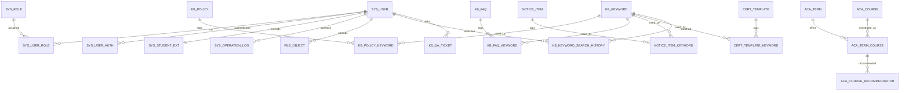

# 学院学生综合服务与党团管理平台——数据库设计说明书

- 文档版本：v1.1
- 数据库脚本：`kingbase_schema.sql`（Oracle 语法版，schema：`campus`）
- 数据库示例数据：`campus_sample_data.sql`（Oracle 语法版）
- 数据库：人大金仓数据库（Kingbase）
- 编写日期：2026-03-27
- 适用范围：小程序端（微信认证）、后台管理平台（账号密码）、统一权限与业务模块数据存储

---

## 1 引言

### 1.1 引言的目的
数据库设计说明书用于系统性描述本项目数据库的设计思想、逻辑结构、物理实现要点与运行维护策略，主要贡献：
- 统一项目成员对“数据模型、表结构、字段含义、约束规则”的理解，降低沟通成本。
- 为后端开发、联调、测试提供数据字典与约束依据，减少线上数据异常。
- 为数据库管理员提供部署、权限、安全、备份恢复与性能优化的标准化参考。

### 1.2 文档格式
本文档采用 Markdown 编写，章节结构如下：
- 第 1～2 章：说明文档目的、DB 选型与运行环境。
- 第 3 章：总体设计（模块划分、ER 关系、命名与共性字段约定）。
- 第 4 章：表详细设计（字段、类型、约束、索引、表关系）。
- 第 5～7 章：外部设计、安全保密、运维管理与维护说明。

### 1.3 预期读者
- 后端开发人员：理解表结构、约束、索引与业务关系。
- 数据库管理员（DBA）：部署配置、权限、安全与运维。
- 测试人员：依据字段与状态枚举设计测试用例与数据准备。
- 项目经理/产品：理解核心数据域、模块边界与关键约束。

### 1.4 参考资料
- Oracle Database SQL Language Reference
- Oracle Database JSON Developer's Guide
- 项目需求文档：统一用户体系、多认证方式、党团流程、通知公告、办事申请、学业审核等模块需求说明
- 数据安全规范：最小权限原则、敏感数据加密/脱敏规范、密码哈希存储规范

---

## 2 数据库选型及运行环境

### 2.1 数据库选型说明（Oracle）
本项目选择 Oracle Database 作为关系型数据库管理系统，原因包括：
- 企业级事务与并发能力成熟：满足业务“流程、审批、办事、通知投递、导入作业”等一致性要求。
- 类型与约束能力完整：支持 `identity`、`timestamp with time zone`、`blob/clob`、`check`、`merge into` 等能力，适合当前结构化主导的数据模型。
- JSON 扩展能力较好：可通过 `clob` + `is json` 约束保留扩展字段，兼顾结构化建模与后续灵活扩展。
- 适合学校项目的稳定运行与运维审计需求：便于权限分层、备份恢复、审计留痕与长期维护。

### 2.2 数据库运行环境（建议）
> 以下为推荐配置，实际以学校服务器与项目并发需求为准。

**硬件建议**
- CPU：4 核起（中等规模建议 8 核）
- 内存：8GB 起（中等规模建议 16GB+）
- 磁盘：SSD 优先；建议单独数据盘；开启写缓存保护
- 网络：千兆内网；数据库端口仅对应用服务器网段开放

**软件建议**
- 操作系统：Linux（生产推荐）或 Windows Server（教学/实验可用）
- 数据库：Oracle Database 19c/21c 或兼容版本
- 时间/时区：统一设置（例如 `Asia/Shanghai`），避免跨系统时间偏差
- 字符集：AL32UTF8/UTF-8，支持中文字段与内容

**性能与可用性建议**
- 定期收集统计信息，关注执行计划、锁等待与高频 SQL 的索引命中情况
- 关键索引覆盖：已在脚本中为高频查询场景建立索引（见第 4 章）
- 备份策略：全量 + 增量 + 定期恢复演练（见第 7 章）

---

## 3 数据库总体设计

### 3.1 数据库结构设计（逻辑结构）
数据库逻辑归属 `campus` schema/user，脚本开头包含：
- `alter session set current_schema = campus;`
- 执行前需确保 `campus` 用户/Schema 已创建完成

整体按业务模块划分为 8 大类：
1) 系统与账号权限：统一用户、角色、用户-角色、认证方式、学生拓展信息、操作日志
2) 文件与附件中心：跨模块复用的文件对象表
3) 政策/FAQ/知识库：政策、FAQ、共享关键词字典、政策/FAQ/通知/模板关键词映射、关键词搜索历史、问答工单
4) 党团流程：流程定义、节点、学生进度、提醒任务
5) 通知公告：公告、标签、投递批次、逐人投递状态
6) 通用审批工作流：工作流定义、节点、实例、任务、操作轨迹
7) 办事申请与证明：申请主表、申请附件、证明模板、证明申请与生成文件
8) 学业审计：培养方案、课程字典、学期、学期开课、成绩单、审核报告、推荐课、数据导入作业

### 3.2 命名与通用字段约定
- 表前缀约定：
  - `sys_`：系统/账号/权限
  - `kb_`：知识库
  - `party_`：党团流程
  - `notice_`：通知公告
  - `wf_`：工作流
  - `affair_`：办事申请
  - `cert_`：证明相关
  - `aca_`：学业审核
- 通用字段约定（大多数业务表）：
  - `id number(19) generated by default as identity`：主键自增
  - `created_at timestamp(6) with time zone default systimestamp`：创建时间
  - `updated_at timestamp(6) with time zone default systimestamp`：更新时间
  - `is_deleted number(1) default 0`：软删除标记，`0` 表示未删除，`1` 表示已删除
  - `is_active number(1) default 1`：启用标记，`1` 表示启用，`0` 表示停用
  - `ext_json clob`：预留扩展字段，配合 `check (ext_json is json)` 保存后续可演进配置
- Oracle SQL 表不使用 `boolean`，布尔语义统一采用 `number(1)` + `check (in (0,1))`。
- 状态字段：通常以 `check (...)` 方式限制枚举取值（如 `status in (...)`），保证数据一致性。

### 3.3 核心 ER 关系（简化）
> 下图为核心数据域简化关系（非全量）。

### 3.4 表清单（全量）
- 系统与权限：`sys_role`, `sys_user`, `sys_user_role`, `sys_user_auth`, `sys_student_ext`, `sys_operation_log`
- 文件：`file_object`
- 知识库：`kb_policy`, `kb_faq`, `kb_keyword`, `kb_policy_keyword`, `kb_faq_keyword`, `kb_keyword_search_history`, `kb_qa_ticket`
- 党团流程：`party_flow`, `party_flow_node`, `party_student_progress`, `party_reminder_task`
- 通知公告：`notice_tag_dict`, `notice_item`, `notice_item_tag`, `notice_item_keyword`, `notice_delivery`, `notice_delivery_target`
- 工作流：`wf_definition`, `wf_node`, `wf_instance`, `wf_task`, `wf_task_action`
- 办事/证明：`affair_request`, `affair_request_attachment`, `cert_template`, `cert_template_keyword`, `cert_application`, `cert_generated_file`
- 学业审核：`aca_program`, `aca_program_module`, `aca_course`, `aca_term`, `aca_term_course`, `aca_module_course`, `aca_transcript`, `aca_transcript_item`, `aca_audit_report`, `aca_audit_missing`, `aca_course_recommendation`
- 导入作业：`audit_import_job`

---

## 4 数据库表详细设计

> 说明：以下“是否可空”与默认值以 DDL 为准；如未显式声明 `not null` 则默认可空。

### 4.1 系统与账号权限模块

#### 4.1.1 角色表：sys_role
**用途**：系统 RBAC 角色定义（四级角色 + 可扩展权限文本）。

| 列名 | 类型 | 主键 | 外键 | 约束/默认 | 说明 |
|---|---|---|---|---|---|
| id | number(19) identity | 是 |  | PK | 角色ID |
| role_code | varchar2(64) |  |  | NOT NULL, UNIQUE | 角色编码（如 student） |
| role_name | varchar2(128) |  |  | NOT NULL | 角色名称 |
| permissions | clob |  |  |  | 权限描述（可选，JSON/文本） |
| is_active | number(1) |  |  | NOT NULL default 1 | 是否启用 |
| created_at | timestamp(6) with time zone |  |  | NOT NULL default systimestamp | 创建时间 |
| updated_at | timestamp(6) with time zone |  |  | NOT NULL default systimestamp | 更新时间 |
| is_deleted | number(1) |  |  | NOT NULL default 0 | 软删除 |

**初始化数据**：通过 `merge into` 初始化 4 个角色：普通学生、班团骨干、管理老师、学院领导。

#### 4.1.2 用户表：sys_user
**用途**：统一用户主档（用于注册校验），覆盖“学生/管理员”在身份层面的统一入口。

| 列名 | 类型 | 主键 | 外键 | 约束/默认 | 说明 |
|---|---|---|---|---|---|
| id | number(19) identity | 是 |  | PK | 用户ID（内部引用） |
| student_no | varchar2(32) |  |  | NOT NULL, UNIQUE | 学号（统一标识） |
| full_name | varchar2(64) |  |  | NOT NULL | 姓名 |
| status | varchar2(32) |  |  | NOT NULL default 'active', CHECK(active/disabled) | 状态 |
| ext_json | clob |  |  | 可空，CHECK(IS JSON) | 预留扩展字段 |
| created_at | timestamp(6) with time zone |  |  | NOT NULL default systimestamp | 创建时间 |
| updated_at | timestamp(6) with time zone |  |  | NOT NULL default systimestamp | 更新时间 |
| is_deleted | number(1) |  |  | NOT NULL default 0 | 软删除 |

#### 4.1.3 用户-角色关系表：sys_user_role
**用途**：用户与角色多对多关系。

| 列名 | 类型 | 主键 | 外键 | 约束/默认 | 说明 |
|---|---|---|---|---|---|
| id | number(19) identity | 是 |  | PK | 关系ID |
| user_id | number(19) |  | sys_user.id | NOT NULL | 用户ID |
| role_id | number(19) |  | sys_role.id | NOT NULL | 角色ID |
| created_at | timestamp(6) with time zone |  |  | NOT NULL default systimestamp | 创建时间 |

**唯一约束**：`unique (user_id, role_id)`

#### 4.1.4 认证表：sys_user_auth
**用途**：多登录方式认证数据（微信认证/密码登录），满足：
- 小程序：学号 + 微信（openid）
- 后台：学号 + 密码

| 列名 | 类型 | 主键 | 外键 | 约束/默认 | 说明 |
|---|---|---|---|---|---|
| id | number(19) identity | 是 |  | PK | 认证记录ID |
| student_no | varchar2(32) |  | sys_user.student_no | NOT NULL | 学号 |
| login_method | varchar2(32) |  |  | NOT NULL, CHECK(wechat/password) | 登录方式 |
| wechat_openid | varchar2(64) |  |  | UNIQUE，可空 | 微信 openid（微信登录时必填） |
| password_hash | varchar2(255) |  |  | 可空 | 密码哈希（密码登录时必填） |
| created_at | timestamp(6) with time zone |  |  | NOT NULL default systimestamp | 创建时间 |
| updated_at | timestamp(6) with time zone |  |  | NOT NULL default systimestamp | 更新时间 |
| is_deleted | number(1) |  |  | NOT NULL default 0 | 软删除 |

**关键约束**
- `unique (student_no, login_method)`：同一学号同一登录方式至多一条
- `unique (wechat_openid)`：openid 全局唯一
- 二选一约束：
  - 微信登录：`wechat_openid is not null and password_hash is null`
  - 密码登录：`password_hash is not null and wechat_openid is null`

#### 4.1.5 学生拓展信息表：sys_student_ext
**用途**：学生扩展档案（专业、年级、班级、政治面貌、入党状态、联系方式等），并对敏感字段提供密文与哈希存储位。

| 列名 | 类型 | 主键 | 外键 | 约束/默认 | 说明 |
|---|---|---|---|---|---|
| student_no | varchar2(32) | 是 | sys_user.student_no | PK | 学号（与用户一对一） |
| major_name | varchar2(128) |  |  | NOT NULL | 专业 |
| grade_year | number(10) |  |  | NOT NULL | 年级 |
| class_name | varchar2(128) |  |  | NOT NULL | 班级 |
| political_status | varchar2(64) |  |  | NOT NULL | 政治面貌 |
| party_status | varchar2(64) |  |  | NOT NULL | 入党/团状态 |
| id_card_cipher | blob |  |  | 可空 | 身份证号密文 |
| id_card_hash | varchar2(64) |  |  | 可空 | 身份证号哈希（用于去重/校验） |
| home_address_cipher | blob |  |  | 可空 | 家庭住址密文 |
| home_address_hash | varchar2(64) |  |  | 可空 | 家庭住址哈希 |
| phone_cipher | blob |  |  | 可空 | 手机号密文 |
| phone_hash | varchar2(64) |  |  | 可空 | 手机号哈希 |
| gpa | number(4,2) |  |  | 可空 | 绩点 |
| ext_json | clob |  |  | 可空，CHECK(IS JSON) | 预留扩展字段 |
| created_at | timestamp(6) with time zone |  |  | NOT NULL default systimestamp | 创建时间 |
| updated_at | timestamp(6) with time zone |  |  | NOT NULL default systimestamp | 更新时间 |
| is_deleted | number(1) |  |  | NOT NULL default 0 | 软删除 |

#### 4.1.6 操作日志表：sys_operation_log
**用途**：记录后台管理、小程序服务、定时任务等触发的关键操作日志，用于审计追踪、问题定位与行为留痕。

| 列名 | 类型 | 主键 | 外键 | 约束/默认 | 说明 |
|---|---|---|---|---|---|
| id | number(19) identity | 是 |  | PK | 日志ID |
| module_code | varchar2(64) |  |  | NOT NULL | 模块编码 |
| business_type | varchar2(64) |  |  | 可空 | 业务类型 |
| business_id | number(19) |  |  | 可空 | 业务主键ID |
| operation_type | varchar2(64) |  |  | NOT NULL | 操作类型 |
| operation_desc | clob |  |  | 可空 | 操作描述 |
| operator_user_id | number(19) |  | sys_user.id | 可空 | 操作人 |
| trace_id | varchar2(128) |  |  | 可空 | 链路追踪ID |
| request_uri | varchar2(512) |  |  | 可空 | 请求路径 |
| request_method | varchar2(16) |  |  | 可空 | 请求方法 |
| request_ip | varchar2(64) |  |  | 可空 | 请求IP |
| user_agent | varchar2(512) |  |  | 可空 | 客户端标识 |
| log_level | varchar2(16) |  |  | NOT NULL default 'info', CHECK(info/warn/error/audit) | 日志级别 |
| result_status | varchar2(16) |  |  | NOT NULL default 'success', CHECK(success/fail/partial) | 执行结果 |
| error_message | clob |  |  | 可空 | 错误信息 |
| ext_json | clob |  |  | 可空，CHECK(IS JSON) | 扩展上下文 |
| created_at | timestamp(6) with time zone |  |  | NOT NULL default systimestamp | 创建时间 |

**索引**
- `idx_sys_operation_log_user(operator_user_id, created_at desc)`
- `idx_sys_operation_log_biz(module_code, business_type, business_id)`
- `idx_sys_operation_log_trace(trace_id)`

### 4.2 文件与附件模块

#### 4.2.1 文件对象表：file_object
**用途**：统一附件/文件元数据中心，供政策/通知/办事/证明/成绩单等复用。

| 列名 | 类型 | 主键 | 外键 | 约束/默认 | 说明 |
|---|---|---|---|---|---|
| id | number(19) identity | 是 |  | PK | 文件ID |
| purpose | varchar2(64) |  |  | NOT NULL | 用途分类 |
| original_name | varchar2(256) |  |  | NOT NULL | 原始文件名 |
| mime_type | varchar2(128) |  |  | 可空 | MIME |
| size_bytes | number(19) |  |  | NOT NULL | 大小 |
| sha256 | varchar2(64) |  |  | 可空 | 摘要 |
| storage_provider | varchar2(64) |  |  | NOT NULL | 存储提供方 |
| storage_path | varchar2(512) |  |  | NOT NULL | 存储路径 |
| uploaded_by | number(19) |  | sys_user.id | 可空 | 上传人 |
| uploaded_at | timestamp(6) with time zone |  |  | NOT NULL default systimestamp | 上传时间 |
| created_at | timestamp(6) with time zone |  |  | NOT NULL default systimestamp | 创建时间 |
| updated_at | timestamp(6) with time zone |  |  | NOT NULL default systimestamp | 更新时间 |
| is_deleted | number(1) |  |  | NOT NULL default 0 | 软删除 |

**索引**
- `idx_file_object_purpose(purpose)`
- `idx_file_object_sha256(sha256)`

### 4.3 政策/知识库模块（kb_*）

#### 4.3.1 政策表：kb_policy
| 列名 | 类型 | 主键 | 外键 | 约束/默认 | 说明 |
|---|---|---|---|---|---|
| id | number(19) identity | 是 |  | PK | 政策ID |
| title | varchar2(256) |  |  | NOT NULL | 标题 |
| summary | clob |  |  | 可空 | 摘要 |
| content | clob |  |  | 可空 | 内容 |
| source_type | varchar2(32) |  |  | NOT NULL default 'manual', CHECK(manual/crawl/import) | 来源类型 |
| source_url | varchar2(512) |  |  | 可空 | 来源链接 |
| attachment_file_id | number(19) |  | file_object.id | 可空 | 附件 |
| is_published | number(1) |  |  | NOT NULL default 1 | 是否发布 |
| published_at | timestamp(6) with time zone |  |  | 可空 | 发布时间 |
| created_by | number(19) |  | sys_user.id | 可空 | 创建人 |
| ext_json | clob |  |  | 可空，CHECK(IS JSON) | 预留扩展字段 |
| created_at | timestamp(6) with time zone |  |  | NOT NULL default systimestamp | 创建时间 |
| updated_at | timestamp(6) with time zone |  |  | NOT NULL default systimestamp | 更新时间 |
| is_deleted | number(1) |  |  | NOT NULL default 0 | 软删除 |

**索引**：`idx_kb_policy_published(is_published, published_at)`

#### 4.3.2 FAQ 表：kb_faq
| 列名 | 类型 | 主键 | 外键 | 约束/默认 | 说明 |
|---|---|---|---|---|---|
| id | number(19) identity | 是 |  | PK | FAQ ID |
| question | varchar2(512) |  |  | NOT NULL | 问题 |
| answer | clob |  |  | NOT NULL | 答案 |
| source_policy_id | number(19) |  | kb_policy.id | 可空 | 关联政策 |
| is_published | number(1) |  |  | NOT NULL default 1 | 是否发布 |
| created_by | number(19) |  | sys_user.id | 可空 | 创建人 |
| ext_json | clob |  |  | 可空，CHECK(IS JSON) | 预留扩展字段 |
| created_at | timestamp(6) with time zone |  |  | NOT NULL default systimestamp | 创建时间 |
| updated_at | timestamp(6) with time zone |  |  | NOT NULL default systimestamp | 更新时间 |
| is_deleted | number(1) |  |  | NOT NULL default 0 | 软删除 |

**索引**：`idx_kb_faq_published(is_published, created_at)`

#### 4.3.3 关键词字典：kb_keyword
| 列名 | 类型 | 主键 | 外键 | 约束/默认 | 说明 |
|---|---|---|---|---|---|
| id | number(19) identity | 是 |  | PK | 关键词ID |
| keyword | varchar2(64) |  |  | NOT NULL, UNIQUE | 关键词 |
| created_at | timestamp(6) with time zone |  |  | NOT NULL default systimestamp | 创建时间 |

**说明**：`kb_keyword` 为共享关键词字典，同时服务政策、FAQ、通知、证明模板与搜索历史等场景。

#### 4.3.4 政策-关键词：kb_policy_keyword
| 列名 | 类型 | 主键 | 外键 | 约束/默认 | 说明 |
|---|---|---|---|---|---|
| id | number(19) identity | 是 |  | PK | 关系ID |
| policy_id | number(19) |  | kb_policy.id | NOT NULL | 政策 |
| keyword_id | number(19) |  | kb_keyword.id | NOT NULL | 关键词 |
| created_at | timestamp(6) with time zone |  |  | NOT NULL default systimestamp | 创建时间 |

**唯一约束**：`unique (policy_id, keyword_id)`

#### 4.3.5 FAQ-关键词：kb_faq_keyword
| 列名 | 类型 | 主键 | 外键 | 约束/默认 | 说明 |
|---|---|---|---|---|---|
| id | number(19) identity | 是 |  | PK | 关系ID |
| faq_id | number(19) |  | kb_faq.id | NOT NULL | FAQ |
| keyword_id | number(19) |  | kb_keyword.id | NOT NULL | 关键词 |
| created_at | timestamp(6) with time zone |  |  | NOT NULL default systimestamp | 创建时间 |

**唯一约束**：`unique (faq_id, keyword_id)`

#### 4.3.6 通知-关键词：notice_item_keyword
| 列名 | 类型 | 主键 | 外键 | 约束/默认 | 说明 |
|---|---|---|---|---|---|
| id | number(19) identity | 是 |  | PK | 关系ID |
| notice_id | number(19) |  | notice_item.id | NOT NULL | 通知 |
| keyword_id | number(19) |  | kb_keyword.id | NOT NULL | 关键词 |
| created_at | timestamp(6) with time zone |  |  | NOT NULL default systimestamp | 创建时间 |

**唯一约束**：`unique (notice_id, keyword_id)`

**索引**：`idx_notice_item_keyword_keyword(keyword_id, notice_id)`

#### 4.3.7 模板-关键词：cert_template_keyword
| 列名 | 类型 | 主键 | 外键 | 约束/默认 | 说明 |
|---|---|---|---|---|---|
| id | number(19) identity | 是 |  | PK | 关系ID |
| template_id | number(19) |  | cert_template.id | NOT NULL | 证明模板 |
| keyword_id | number(19) |  | kb_keyword.id | NOT NULL | 关键词 |
| created_at | timestamp(6) with time zone |  |  | NOT NULL default systimestamp | 创建时间 |

**唯一约束**：`unique (template_id, keyword_id)`

**索引**：`idx_cert_template_keyword_keyword(keyword_id, template_id)`

#### 4.3.8 关键词搜索历史：kb_keyword_search_history
| 列名 | 类型 | 主键 | 外键 | 约束/默认 | 说明 |
|---|---|---|---|---|---|
| id | number(19) identity | 是 |  | PK | 历史记录ID |
| search_user_id | number(19) |  | sys_user.id | 可空 | 搜索用户 |
| keyword_id | number(19) |  | kb_keyword.id | 可空 | 命中字典关键词 |
| search_keyword | varchar2(128) |  |  | NOT NULL | 搜索词原文 |
| search_scope | varchar2(32) |  |  | NOT NULL default 'all', CHECK(all/policy/faq/notice/template) | 搜索范围 |
| search_channel | varchar2(32) |  |  | NOT NULL default 'miniprogram', CHECK(miniprogram/admin/api/other) | 搜索渠道 |
| result_count | number(10) |  |  | NOT NULL default 0 | 命中数量 |
| session_token | varchar2(128) |  |  | 可空 | 会话标识 |
| client_ip | varchar2(64) |  |  | 可空 | 客户端IP |
| ext_json | clob |  |  | 可空，CHECK(IS JSON) | 扩展上下文 |
| created_at | timestamp(6) with time zone |  |  | NOT NULL default systimestamp | 搜索时间 |

**索引**
- `idx_kb_keyword_search_user(search_user_id, created_at desc)`
- `idx_kb_keyword_search_keyword(keyword_id, created_at desc)`
- `idx_kb_keyword_search_text(search_keyword, created_at desc)`

#### 4.3.9 问答工单：kb_qa_ticket
| 列名 | 类型 | 主键 | 外键 | 约束/默认 | 说明 |
|---|---|---|---|---|---|
| id | number(19) identity | 是 |  | PK | 工单ID |
| ask_user_id | number(19) |  | sys_user.id | NOT NULL | 提问人 |
| question_text | clob |  |  | NOT NULL | 问题内容 |
| status | varchar2(32) |  |  | NOT NULL default 'open', CHECK(open/answered/closed) | 状态 |
| matched_faq_id | number(19) |  | kb_faq.id | 可空 | 匹配FAQ |
| handled_by | number(19) |  | sys_user.id | 可空 | 处理人 |
| handled_at | timestamp(6) with time zone |  |  | 可空 | 处理时间 |
| created_at | timestamp(6) with time zone |  |  | NOT NULL default systimestamp | 创建时间 |
| updated_at | timestamp(6) with time zone |  |  | NOT NULL default systimestamp | 更新时间 |

**索引**：`idx_kb_qa_ticket_status(status, created_at)`

### 4.4 党团流程模块（party_*）

#### 4.4.1 流程定义：party_flow
| 列名 | 类型 | 主键 | 外键 | 约束/默认 | 说明 |
|---|---|---|---|---|---|
| id | number(19) identity | 是 |  | PK | 流程ID |
| flow_code | varchar2(64) |  |  | NOT NULL, UNIQUE | 流程编码 |
| flow_name | varchar2(128) |  |  | NOT NULL | 流程名称 |
| flow_type | varchar2(32) |  |  | NOT NULL, CHECK(party/league) | 流程类型 |
| is_active | number(1) |  |  | NOT NULL default 1 | 是否启用 |
| created_by | number(19) |  | sys_user.id | 可空 | 创建人 |
| created_at | timestamp(6) with time zone |  |  | NOT NULL default systimestamp | 创建时间 |
| updated_at | timestamp(6) with time zone |  |  | NOT NULL default systimestamp | 更新时间 |
| is_deleted | number(1) |  |  | NOT NULL default 0 | 软删除 |

#### 4.4.2 流程节点：party_flow_node
| 列名 | 类型 | 主键 | 外键 | 约束/默认 | 说明 |
|---|---|---|---|---|---|
| id | number(19) identity | 是 |  | PK | 节点ID |
| flow_id | number(19) |  | party_flow.id | NOT NULL | 流程 |
| seq_no | number(10) |  |  | NOT NULL | 顺序号 |
| node_code | varchar2(64) |  |  | NOT NULL | 节点编码 |
| node_name | varchar2(128) |  |  | NOT NULL | 节点名称 |
| description | clob |  |  | 可空 | 描述 |
| expected_days | number(10) |  |  | 可空 | 预计耗时（天） |
| reminder_offset_days | number(10) |  |  | 可空 | 提前提醒天数 |
| created_at | timestamp(6) with time zone |  |  | NOT NULL default systimestamp | 创建时间 |
| updated_at | timestamp(6) with time zone |  |  | NOT NULL default systimestamp | 更新时间 |
| is_deleted | number(1) |  |  | NOT NULL default 0 | 软删除 |

**唯一约束**
- `unique (flow_id, seq_no)`
- `unique (flow_id, node_code)`

**索引**：`idx_party_flow_node_flow(flow_id, seq_no)`

#### 4.4.3 学生流程进度：party_student_progress
| 列名 | 类型 | 主键 | 外键 | 约束/默认 | 说明 |
|---|---|---|---|---|---|
| id | number(19) identity | 是 |  | PK | 进度ID |
| student_user_id | number(19) |  | sys_user.id | NOT NULL | 学生用户 |
| flow_id | number(19) |  | party_flow.id | NOT NULL | 流程 |
| current_node_id | number(19) |  | party_flow_node.id | 可空 | 当前节点 |
| status | varchar2(32) |  |  | NOT NULL default 'in_progress', CHECK(not_started/in_progress/paused/completed) | 状态 |
| started_at | timestamp(6) with time zone |  |  | 可空 | 开始时间 |
| updated_node_at | timestamp(6) with time zone |  |  | 可空 | 节点更新时间 |
| next_deadline_at | timestamp(6) with time zone |  |  | 可空 | 下次截止时间 |
| created_at | timestamp(6) with time zone |  |  | NOT NULL default systimestamp | 创建时间 |
| updated_at | timestamp(6) with time zone |  |  | NOT NULL default systimestamp | 更新时间 |
| is_deleted | number(1) |  |  | NOT NULL default 0 | 软删除 |

**唯一约束**：`unique (student_user_id, flow_id)`

**索引**：`idx_party_student_progress_deadline(next_deadline_at)`

#### 4.4.4 流程提醒任务：party_reminder_task
| 列名 | 类型 | 主键 | 外键 | 约束/默认 | 说明 |
|---|---|---|---|---|---|
| id | number(19) identity | 是 |  | PK | 提醒ID |
| progress_id | number(19) |  | party_student_progress.id | NOT NULL | 关联进度 |
| node_id | number(19) |  | party_flow_node.id | NOT NULL | 关联节点 |
| due_at | timestamp(6) with time zone |  |  | NOT NULL | 到期时间 |
| channel | varchar2(32) |  |  | NOT NULL, CHECK(miniprogram/sms/email) | 渠道 |
| status | varchar2(32) |  |  | NOT NULL default 'pending', CHECK(pending/sent/canceled/failed) | 状态 |
| sent_at | timestamp(6) with time zone |  |  | 可空 | 发送时间 |
| created_at | timestamp(6) with time zone |  |  | NOT NULL default systimestamp | 创建时间 |
| updated_at | timestamp(6) with time zone |  |  | NOT NULL default systimestamp | 更新时间 |

**索引**：`idx_party_reminder_due(status, due_at)`

### 4.5 通知公告模块（notice_*）

#### 4.5.1 通知标签字典：notice_tag_dict
| 列名 | 类型 | 主键 | 外键 | 约束/默认 | 说明 |
|---|---|---|---|---|---|
| id | number(19) identity | 是 |  | PK | 标签ID |
| tag_code | varchar2(64) |  |  | NOT NULL, UNIQUE | 标签编码 |
| tag_name | varchar2(64) |  |  | NOT NULL | 标签名称 |
| created_at | timestamp(6) with time zone |  |  | NOT NULL default systimestamp | 创建时间 |
| updated_at | timestamp(6) with time zone |  |  | NOT NULL default systimestamp | 更新时间 |
| is_deleted | number(1) |  |  | NOT NULL default 0 | 软删除 |

#### 4.5.2 通知公告：notice_item
| 列名 | 类型 | 主键 | 外键 | 约束/默认 | 说明 |
|---|---|---|---|---|---|
| id | number(19) identity | 是 |  | PK | 通知ID |
| title | varchar2(256) |  |  | NOT NULL | 标题 |
| content | clob |  |  | 可空 | 内容 |
| source_type | varchar2(32) |  |  | NOT NULL default 'manual', CHECK(manual/crawl/import) | 来源 |
| source_name | varchar2(128) |  |  | 可空 | 来源名称 |
| source_url | varchar2(512) |  |  | 可空 | 来源链接 |
| attachment_file_id | number(19) |  | file_object.id | 可空 | 附件 |
| publish_at | timestamp(6) with time zone |  |  | 可空 | 计划/实际发布时间 |
| created_by | number(19) |  | sys_user.id | 可空 | 创建人 |
| ext_json | clob |  |  | 可空，CHECK(IS JSON) | 预留扩展字段 |
| created_at | timestamp(6) with time zone |  |  | NOT NULL default systimestamp | 创建时间 |
| updated_at | timestamp(6) with time zone |  |  | NOT NULL default systimestamp | 更新时间 |
| is_deleted | number(1) |  |  | NOT NULL default 0 | 软删除 |

**索引**：`idx_notice_item_publish(publish_at desc)`

#### 4.5.3 通知-标签：notice_item_tag
| 列名 | 类型 | 主键 | 外键 | 约束/默认 | 说明 |
|---|---|---|---|---|---|
| id | number(19) identity | 是 |  | PK | 关系ID |
| notice_id | number(19) |  | notice_item.id | NOT NULL | 通知 |
| tag_id | number(19) |  | notice_tag_dict.id | NOT NULL | 标签 |
| created_at | timestamp(6) with time zone |  |  | NOT NULL default systimestamp | 创建时间 |

**唯一约束**：`unique (notice_id, tag_id)`

#### 4.5.4 投递批次：notice_delivery
| 列名 | 类型 | 主键 | 外键 | 约束/默认 | 说明 |
|---|---|---|---|---|---|
| id | number(19) identity | 是 |  | PK | 投递批次ID |
| notice_id | number(19) |  | notice_item.id | NOT NULL | 通知 |
| channel | varchar2(32) |  |  | NOT NULL, CHECK(miniprogram/sms/email) | 渠道 |
| target_rule_json | clob |  |  | 可空，CHECK(IS JSON) | 目标规则（JSON文本） |
| status | varchar2(32) |  |  | NOT NULL default 'queued', CHECK(queued/sending/done/failed/canceled) | 状态 |
| scheduled_at | timestamp(6) with time zone |  |  | 可空 | 计划发送时间 |
| sent_at | timestamp(6) with time zone |  |  | 可空 | 实际发送时间 |
| created_by | number(19) |  | sys_user.id | 可空 | 创建人 |
| ext_json | clob |  |  | 可空，CHECK(IS JSON) | 预留扩展字段 |
| created_at | timestamp(6) with time zone |  |  | NOT NULL default systimestamp | 创建时间 |
| updated_at | timestamp(6) with time zone |  |  | NOT NULL default systimestamp | 更新时间 |

**索引**：`idx_notice_delivery_status(status, scheduled_at)`

#### 4.5.5 逐人投递：notice_delivery_target
| 列名 | 类型 | 主键 | 外键 | 约束/默认 | 说明 |
|---|---|---|---|---|---|
| id | number(19) identity | 是 |  | PK | 明细ID |
| delivery_id | number(19) |  | notice_delivery.id | NOT NULL | 投递批次 |
| target_user_id | number(19) |  | sys_user.id | NOT NULL | 目标用户 |
| status | varchar2(32) |  |  | NOT NULL default 'queued', CHECK(queued/sent/failed/canceled) | 状态 |
| sent_at | timestamp(6) with time zone |  |  | 可空 | 发送时间 |
| error_message | clob |  |  | 可空 | 失败原因 |
| created_at | timestamp(6) with time zone |  |  | NOT NULL default systimestamp | 创建时间 |
| updated_at | timestamp(6) with time zone |  |  | NOT NULL default systimestamp | 更新时间 |

**唯一约束**：`unique (delivery_id, target_user_id)`

**索引**：`idx_notice_delivery_target_status(status, created_at)`

### 4.6 通用工作流模块（wf_*）

#### 4.6.1 工作流定义：wf_definition
| 列名 | 类型 | 主键 | 外键 | 约束/默认 | 说明 |
|---|---|---|---|---|---|
| id | number(19) identity | 是 |  | PK | 工作流ID |
| wf_code | varchar2(64) |  |  | NOT NULL, UNIQUE | 编码 |
| wf_name | varchar2(128) |  |  | NOT NULL | 名称 |
| business_type | varchar2(64) |  |  | NOT NULL | 业务类型 |
| is_active | number(1) |  |  | NOT NULL default 1 | 是否启用 |
| created_by | number(19) |  | sys_user.id | 可空 | 创建人 |
| created_at | timestamp(6) with time zone |  |  | NOT NULL default systimestamp | 创建时间 |
| updated_at | timestamp(6) with time zone |  |  | NOT NULL default systimestamp | 更新时间 |
| is_deleted | number(1) |  |  | NOT NULL default 0 | 软删除 |

#### 4.6.2 工作流节点：wf_node
| 列名 | 类型 | 主键 | 外键 | 约束/默认 | 说明 |
|---|---|---|---|---|---|
| id | number(19) identity | 是 |  | PK | 节点ID |
| wf_id | number(19) |  | wf_definition.id | NOT NULL | 工作流 |
| seq_no | number(10) |  |  | NOT NULL | 顺序号 |
| node_name | varchar2(128) |  |  | NOT NULL | 节点名 |
| approver_role_id | number(19) |  | sys_role.id | 可空 | 审批角色 |
| approver_user_id | number(19) |  | sys_user.id | 可空 | 指定审批人 |
| sla_hours | number(10) |  |  | 可空 | SLA 小时 |
| allow_reject | number(1) |  |  | NOT NULL default 1 | 是否允许驳回 |
| created_at | timestamp(6) with time zone |  |  | NOT NULL default systimestamp | 创建时间 |
| updated_at | timestamp(6) with time zone |  |  | NOT NULL default systimestamp | 更新时间 |
| is_deleted | number(1) |  |  | NOT NULL default 0 | 软删除 |

**唯一约束**：`unique (wf_id, seq_no)`

#### 4.6.3 工作流实例：wf_instance
| 列名 | 类型 | 主键 | 外键 | 约束/默认 | 说明 |
|---|---|---|---|---|---|
| id | number(19) identity | 是 |  | PK | 实例ID |
| wf_id | number(19) |  | wf_definition.id | NOT NULL | 工作流 |
| business_table | varchar2(64) |  |  | NOT NULL | 业务表名 |
| business_id | number(19) |  |  | NOT NULL | 业务主键ID |
| status | varchar2(32) |  |  | NOT NULL default 'running', CHECK(running/approved/rejected/canceled) | 状态 |
| started_by | number(19) |  | sys_user.id | NOT NULL | 发起人 |
| started_at | timestamp(6) with time zone |  |  | NOT NULL default systimestamp | 发起时间 |
| finished_at | timestamp(6) with time zone |  |  | 可空 | 结束时间 |
| created_at | timestamp(6) with time zone |  |  | NOT NULL default systimestamp | 创建时间 |
| updated_at | timestamp(6) with time zone |  |  | NOT NULL default systimestamp | 更新时间 |

**索引**
- `idx_wf_instance_biz(business_table, business_id)`
- `idx_wf_instance_status(status, started_at)`

#### 4.6.4 待办任务：wf_task
| 列名 | 类型 | 主键 | 外键 | 约束/默认 | 说明 |
|---|---|---|---|---|---|
| id | number(19) identity | 是 |  | PK | 任务ID |
| wf_instance_id | number(19) |  | wf_instance.id | NOT NULL | 实例 |
| wf_node_id | number(19) |  | wf_node.id | NOT NULL | 节点 |
| assignee_user_id | number(19) |  | sys_user.id | 可空 | 指派人 |
| status | varchar2(32) |  |  | NOT NULL default 'pending', CHECK(pending/approved/rejected/canceled) | 状态 |
| due_at | timestamp(6) with time zone |  |  | 可空 | 截止时间 |
| completed_at | timestamp(6) with time zone |  |  | 可空 | 完成时间 |
| created_at | timestamp(6) with time zone |  |  | NOT NULL default systimestamp | 创建时间 |
| updated_at | timestamp(6) with time zone |  |  | NOT NULL default systimestamp | 更新时间 |

**索引**：`idx_wf_task_status(status, due_at)`

#### 4.6.5 任务操作轨迹：wf_task_action
| 列名 | 类型 | 主键 | 外键 | 约束/默认 | 说明 |
|---|---|---|---|---|---|
| id | number(19) identity | 是 |  | PK | 轨迹ID |
| wf_task_id | number(19) |  | wf_task.id | NOT NULL | 任务 |
| actor_user_id | number(19) |  | sys_user.id | NOT NULL | 操作人 |
| action | varchar2(32) |  |  | NOT NULL, CHECK(approve/reject/cancel/transfer) | 动作 |
| action_comment | clob |  |  | 可空 | 备注 |
| action_at | timestamp(6) with time zone |  |  | NOT NULL default systimestamp | 动作时间 |
| created_at | timestamp(6) with time zone |  |  | NOT NULL default systimestamp | 创建时间 |

### 4.7 办事申请与证明模块（affair_*, cert_*）

#### 4.7.1 办事申请主表：affair_request
| 列名 | 类型 | 主键 | 外键 | 约束/默认 | 说明 |
|---|---|---|---|---|---|
| id | number(19) identity | 是 |  | PK | 申请ID |
| requester_user_id | number(19) |  | sys_user.id | NOT NULL | 申请人 |
| request_type | varchar2(32) |  |  | NOT NULL, CHECK(certificate/leave/stamp/budget/other) | 类型 |
| title | varchar2(256) |  |  | 可空 | 标题 |
| purpose | varchar2(256) |  |  | NOT NULL | 用途 |
| remark | clob |  |  | 可空 | 备注 |
| payload_json | clob |  |  | 可空，CHECK(IS JSON) | 表单JSON |
| status | varchar2(32) |  |  | NOT NULL default 'draft', CHECK(draft/submitted/in_review/approved/rejected/canceled/closed) | 状态 |
| submitted_at | timestamp(6) with time zone |  |  | 可空 | 提交时间 |
| closed_at | timestamp(6) with time zone |  |  | 可空 | 结束时间 |
| created_at | timestamp(6) with time zone |  |  | NOT NULL default systimestamp | 创建时间 |
| updated_at | timestamp(6) with time zone |  |  | NOT NULL default systimestamp | 更新时间 |
| is_deleted | number(1) |  |  | NOT NULL default 0 | 软删除 |

**索引**
- `idx_affair_request_requester(requester_user_id, created_at desc)`
- `idx_affair_request_status(status, submitted_at desc)`

#### 4.7.2 申请-附件：affair_request_attachment
| 列名 | 类型 | 主键 | 外键 | 约束/默认 | 说明 |
|---|---|---|---|---|---|
| id | number(19) identity | 是 |  | PK | 关系ID |
| request_id | number(19) |  | affair_request.id | NOT NULL | 申请 |
| file_id | number(19) |  | file_object.id | NOT NULL | 文件 |
| created_at | timestamp(6) with time zone |  |  | NOT NULL default systimestamp | 创建时间 |

**唯一约束**：`unique (request_id, file_id)`

#### 4.7.3 证明模板：cert_template
| 列名 | 类型 | 主键 | 外键 | 约束/默认 | 说明 |
|---|---|---|---|---|---|
| id | number(19) identity | 是 |  | PK | 模板ID |
| template_code | varchar2(64) |  |  | NOT NULL, UNIQUE | 模板编码 |
| template_name | varchar2(128) |  |  | NOT NULL | 模板名称 |
| file_id | number(19) |  | file_object.id | NOT NULL | 模板文件 |
| output_format | varchar2(16) |  |  | NOT NULL default 'pdf', CHECK(pdf) | 输出格式 |
| is_active | number(1) |  |  | NOT NULL default 1 | 是否启用 |
| created_by | number(19) |  | sys_user.id | 可空 | 创建人 |
| ext_json | clob |  |  | 可空，CHECK(IS JSON) | 预留扩展字段 |
| created_at | timestamp(6) with time zone |  |  | NOT NULL default systimestamp | 创建时间 |
| updated_at | timestamp(6) with time zone |  |  | NOT NULL default systimestamp | 更新时间 |
| is_deleted | number(1) |  |  | NOT NULL default 0 | 软删除 |

**说明**：模板关键词映射关系由 `cert_template_keyword` 表维护，详见 4.3.7。

#### 4.7.4 证明申请：cert_application
| 列名 | 类型 | 主键 | 外键 | 约束/默认 | 说明 |
|---|---|---|---|---|---|
| id | number(19) identity | 是 |  | PK | 证明申请ID |
| request_id | number(19) |  | affair_request.id | NOT NULL | 关联办事申请 |
| template_id | number(19) |  | cert_template.id | NOT NULL | 模板 |
| generated_pdf_file_id | number(19) |  | file_object.id | 可空 | 生成PDF |
| student_snapshot_json | clob |  |  | 可空，CHECK(IS JSON) | 学生快照 |
| created_at | timestamp(6) with time zone |  |  | NOT NULL default systimestamp | 创建时间 |
| updated_at | timestamp(6) with time zone |  |  | NOT NULL default systimestamp | 更新时间 |

**唯一约束**：`unique (request_id)`（一个申请对应一条证明记录）

#### 4.7.5 证明生成文件关联：cert_generated_file
| 列名 | 类型 | 主键 | 外键 | 约束/默认 | 说明 |
|---|---|---|---|---|---|
| id | number(19) identity | 是 |  | PK | 关系ID |
| cert_app_id | number(19) |  | cert_application.id | NOT NULL | 证明申请 |
| file_id | number(19) |  | file_object.id | NOT NULL | 文件 |
| created_at | timestamp(6) with time zone |  |  | NOT NULL default systimestamp | 创建时间 |

**唯一约束**：`unique (cert_app_id, file_id)`

### 4.8 学业审核模块（aca_*）

#### 4.8.1 培养方案：aca_program
| 列名 | 类型 | 主键 | 外键 | 约束/默认 | 说明 |
|---|---|---|---|---|---|
| id | number(19) identity | 是 |  | PK | 方案ID |
| program_code | varchar2(64) |  |  | NOT NULL, UNIQUE | 方案编码 |
| major_name | varchar2(128) |  |  | NOT NULL | 专业 |
| grade_year | number(10) |  |  | NOT NULL | 年级 |
| version_name | varchar2(64) |  |  | NOT NULL | 版本名 |
| description | clob |  |  | 可空 | 描述 |
| is_active | number(1) |  |  | NOT NULL default 1 | 是否启用 |
| created_by | number(19) |  | sys_user.id | 可空 | 创建人 |
| ext_json | clob |  |  | 可空，CHECK(IS JSON) | 预留扩展字段 |
| created_at | timestamp(6) with time zone |  |  | NOT NULL default systimestamp | 创建时间 |
| updated_at | timestamp(6) with time zone |  |  | NOT NULL default systimestamp | 更新时间 |
| is_deleted | number(1) |  |  | NOT NULL default 0 | 软删除 |

**索引**：`idx_aca_program_major_grade(major_name, grade_year, is_active)`

#### 4.8.2 方案模块：aca_program_module
| 列名 | 类型 | 主键 | 外键 | 约束/默认 | 说明 |
|---|---|---|---|---|---|
| id | number(19) identity | 是 |  | PK | 模块ID |
| program_id | number(19) |  | aca_program.id | NOT NULL | 方案 |
| module_code | varchar2(64) |  |  | NOT NULL | 模块编码 |
| module_name | varchar2(128) |  |  | NOT NULL | 模块名称 |
| module_type | varchar2(32) |  |  | NOT NULL, CHECK(required/elective/general) | 类型 |
| required_credits | number(6,2) |  |  | NOT NULL | 要求学分 |
| created_at | timestamp(6) with time zone |  |  | NOT NULL default systimestamp | 创建时间 |
| updated_at | timestamp(6) with time zone |  |  | NOT NULL default systimestamp | 更新时间 |
| is_deleted | number(1) |  |  | NOT NULL default 0 | 软删除 |

**唯一约束**：`unique (program_id, module_code)`

#### 4.8.3 课程字典：aca_course
| 列名 | 类型 | 主键 | 外键 | 约束/默认 | 说明 |
|---|---|---|---|---|---|
| id | number(19) identity | 是 |  | PK | 课程ID |
| course_code | varchar2(64) |  |  | NOT NULL, UNIQUE | 课程编码 |
| course_name | varchar2(256) |  |  | NOT NULL | 课程名称 |
| credits | number(5,2) |  |  | NOT NULL default 0 | 学分 |
| course_type | varchar2(32) |  |  | NOT NULL default 'unknown', CHECK(required/elective/general/unknown) | 类型 |
| created_at | timestamp(6) with time zone |  |  | NOT NULL default systimestamp | 创建时间 |
| updated_at | timestamp(6) with time zone |  |  | NOT NULL default systimestamp | 更新时间 |
| is_deleted | number(1) |  |  | NOT NULL default 0 | 软删除 |

**索引**：`idx_aca_course_name(course_name)`

#### 4.8.4 学期表：aca_term
| 列名 | 类型 | 主键 | 外键 | 约束/默认 | 说明 |
|---|---|---|---|---|---|
| id | number(19) identity | 是 |  | PK | 学期ID |
| term_code | varchar2(64) |  |  | NOT NULL, UNIQUE | 学期编码 |
| term_name | varchar2(128) |  |  | NOT NULL | 学期名称 |
| academic_year | varchar2(32) |  |  | NOT NULL | 学年 |
| semester_no | number(10) |  |  | NOT NULL, CHECK(1/2/3) | 学期序号 |
| start_date | date |  |  | 可空 | 开始日期 |
| end_date | date |  |  | 可空 | 结束日期 |
| is_current | number(1) |  |  | NOT NULL default 0 | 是否当前学期 |
| created_at | timestamp(6) with time zone |  |  | NOT NULL default systimestamp | 创建时间 |
| updated_at | timestamp(6) with time zone |  |  | NOT NULL default systimestamp | 更新时间 |
| is_deleted | number(1) |  |  | NOT NULL default 0 | 软删除 |

**索引**：`idx_aca_term_year_semester(academic_year, semester_no, is_current)`

#### 4.8.5 学期开课表：aca_term_course
**用途**：记录教务处各学期实际开设的课程班次。`teacher_name` 仅作为字符串保存，不与系统内用户表关联；同一 `course_code` 在同一学期可因不同老师、不同教学班而存在多条记录。

| 列名 | 类型 | 主键 | 外键 | 约束/默认 | 说明 |
|---|---|---|---|---|---|
| id | number(19) identity | 是 |  | PK | 开课记录ID |
| term_id | number(19) |  | aca_term.id | NOT NULL | 学期 |
| course_id | number(19) |  | aca_course.id | 可空 | 关联课程字典 |
| teaching_class_code | varchar2(64) |  |  | 可空 | 教学班编码 |
| course_code | varchar2(64) |  |  | NOT NULL | 课程编码 |
| course_name | varchar2(256) |  |  | NOT NULL | 课程名称 |
| teacher_name | varchar2(128) |  |  | NOT NULL | 授课老师（字符串） |
| course_location | varchar2(256) |  |  | 可空 | 上课地点 |
| credits | number(5,2) |  |  | NOT NULL default 0 | 学分 |
| total_hours | number(6,2) |  |  | NOT NULL default 0 | 学时 |
| created_at | timestamp(6) with time zone |  |  | NOT NULL default systimestamp | 创建时间 |
| updated_at | timestamp(6) with time zone |  |  | NOT NULL default systimestamp | 更新时间 |
| is_deleted | number(1) |  |  | NOT NULL default 0 | 软删除 |

**唯一约束**：`unique (term_id, teaching_class_code)`（当教学班编码存在时生效）

**索引**
- `idx_aca_term_course_term_code(term_id, course_code)`
- `idx_aca_term_course_course(course_id)`

#### 4.8.6 模块-课程：aca_module_course
| 列名 | 类型 | 主键 | 外键 | 约束/默认 | 说明 |
|---|---|---|---|---|---|
| id | number(19) identity | 是 |  | PK | 关系ID |
| module_id | number(19) |  | aca_program_module.id | NOT NULL | 模块 |
| course_id | number(19) |  | aca_course.id | NOT NULL | 课程 |
| created_at | timestamp(6) with time zone |  |  | NOT NULL default systimestamp | 创建时间 |

**唯一约束**：`unique (module_id, course_id)`

#### 4.8.7 成绩单导入任务：aca_transcript
| 列名 | 类型 | 主键 | 外键 | 约束/默认 | 说明 |
|---|---|---|---|---|---|
| id | number(19) identity | 是 |  | PK | 成绩单ID |
| student_user_id | number(19) |  | sys_user.id | NOT NULL | 学生 |
| source_file_id | number(19) |  | file_object.id | NOT NULL | 来源文件 |
| parse_status | varchar2(32) |  |  | NOT NULL default 'pending', CHECK(pending/parsed/failed) | 解析状态 |
| parsed_at | timestamp(6) with time zone |  |  | 可空 | 解析时间 |
| total_credits | number(7,2) |  |  | 可空 | 总学分 |
| gpa | number(4,2) |  |  | 可空 | 绩点 |
| created_at | timestamp(6) with time zone |  |  | NOT NULL default systimestamp | 创建时间 |
| updated_at | timestamp(6) with time zone |  |  | NOT NULL default systimestamp | 更新时间 |

**索引**：`idx_aca_transcript_student(student_user_id, created_at desc)`

#### 4.8.8 成绩明细：aca_transcript_item
| 列名 | 类型 | 主键 | 外键 | 约束/默认 | 说明 |
|---|---|---|---|---|---|
| id | number(19) identity | 是 |  | PK | 明细ID |
| transcript_id | number(19) |  | aca_transcript.id | NOT NULL | 成绩单 |
| term | varchar2(32) |  |  | 可空 | 学期 |
| course_code | varchar2(64) |  |  | 可空 | 课程编码 |
| course_name | varchar2(256) |  |  | NOT NULL | 课程名 |
| credits | number(5,2) |  |  | NOT NULL default 0 | 学分 |
| grade_text | varchar2(32) |  |  | 可空 | 成绩文本 |
| grade_point | number(4,2) |  |  | 可空 | 绩点 |
| passed | number(1) |  |  | NOT NULL default 1 | 是否通过 |
| created_at | timestamp(6) with time zone |  |  | NOT NULL default systimestamp | 创建时间 |

**索引**：`idx_aca_transcript_item_transcript(transcript_id)`

#### 4.8.9 学业审核报告：aca_audit_report
| 列名 | 类型 | 主键 | 外键 | 约束/默认 | 说明 |
|---|---|---|---|---|---|
| id | number(19) identity | 是 |  | PK | 报告ID |
| student_user_id | number(19) |  | sys_user.id | NOT NULL | 学生 |
| program_id | number(19) |  | aca_program.id | NOT NULL | 培养方案 |
| transcript_id | number(19) |  | aca_transcript.id | NOT NULL | 成绩单 |
| status | varchar2(32) |  |  | NOT NULL default 'generated', CHECK(generated/outdated) | 状态 |
| missing_module_count | number(10) |  |  | NOT NULL default 0 | 缺失模块数 |
| generated_at | timestamp(6) with time zone |  |  | NOT NULL default systimestamp | 生成时间 |
| created_at | timestamp(6) with time zone |  |  | NOT NULL default systimestamp | 创建时间 |
| updated_at | timestamp(6) with time zone |  |  | NOT NULL default systimestamp | 更新时间 |

**索引**：`idx_aca_audit_report_student(student_user_id, generated_at desc)`

#### 4.8.10 报告-缺失模块：aca_audit_missing
| 列名 | 类型 | 主键 | 外键 | 约束/默认 | 说明 |
|---|---|---|---|---|---|
| id | number(19) identity | 是 |  | PK | 记录ID |
| report_id | number(19) |  | aca_audit_report.id | NOT NULL | 报告 |
| module_id | number(19) |  | aca_program_module.id | NOT NULL | 模块 |
| missing_credits | number(6,2) |  |  | NOT NULL | 缺失学分 |
| created_at | timestamp(6) with time zone |  |  | NOT NULL default systimestamp | 创建时间 |

**唯一约束**：`unique (report_id, module_id)`

#### 4.8.11 报告-课程推荐：aca_course_recommendation
| 列名 | 类型 | 主键 | 外键 | 约束/默认 | 说明 |
|---|---|---|---|---|---|
| id | number(19) identity | 是 |  | PK | 推荐ID |
| report_id | number(19) |  | aca_audit_report.id | NOT NULL | 报告 |
| module_id | number(19) |  | aca_program_module.id | NOT NULL | 模块 |
| course_id | number(19) |  | aca_term_course.id | NOT NULL | 推荐开课记录 |
| recommendation_reason | clob |  |  | 可空 | 推荐原因 |
| created_at | timestamp(6) with time zone |  |  | NOT NULL default systimestamp | 创建时间 |

**唯一约束**：`unique (report_id, course_id)`

**说明**：此处 `course_id` 指向 `aca_term_course.id`，表示“某学期某老师实际开设的一门课”，而非 `aca_course` 课程字典主键。

### 4.9 数据导入作业模块

#### 4.9.1 文件导入：audit_import_job
| 列名 | 类型 | 主键 | 外键 | 约束/默认 | 说明 |
|---|---|---|---|---|---|
| id | number(19) identity | 是 |  | PK | 作业ID |
| job_type | varchar2(64) |  |  | NOT NULL | 作业类型 |
| source_file_id | number(19) |  | file_object.id | NOT NULL | 来源文件 |
| status | varchar2(32) |  |  | NOT NULL default 'running', CHECK(running/done/failed/canceled) | 状态 |
| total_rows | number(10) |  |  | 可空 | 总行数 |
| success_rows | number(10) |  |  | 可空 | 成功行数 |
| failed_rows | number(10) |  |  | 可空 | 失败行数 |
| error_message | clob |  |  | 可空 | 错误信息 |
| result_json | clob |  |  | 可空，CHECK(IS JSON) | 结果JSON |
| started_by | number(19) |  | sys_user.id | 可空 | 启动人 |
| started_at | timestamp(6) with time zone |  |  | NOT NULL default systimestamp | 开始时间 |
| finished_at | timestamp(6) with time zone |  |  | 可空 | 结束时间 |
| created_at | timestamp(6) with time zone |  |  | NOT NULL default systimestamp | 创建时间 |
| updated_at | timestamp(6) with time zone |  |  | NOT NULL default systimestamp | 更新时间 |

**索引**：`idx_audit_import_job_status(status, started_at)`

---

## 5 外部设计

### 5.1 标识符和状态
- 主键标识：绝大多数表使用 `number(19) identity` 自增主键，便于关联与索引。
- 学号标识：`sys_user.student_no` 为用户统一业务标识，并用于认证表、学生拓展表关联。
- 状态码设计：通过 `check` 约束限制合法值（例如用户状态、工单状态、工作流状态、办事申请状态、通知投递状态等）。
- 布尔语义设计：Oracle 表结构中统一使用 `number(1)` 表示布尔值，`0/1` 的含义由字段注释和 `check` 约束共同保证。

### 5.2 使用数据库的程序
- 微信小程序端：查询用户基础信息、党团流程进度、通知公告、提交办事申请、查看证明/文件等。
- 后台管理平台（网页）：账号密码登录，维护政策/FAQ/通知/流程/工作流/模板/培养方案、关键词映射与日志查询等。
- 后端服务：提供统一认证与授权、文件上传下载、流程/审批引擎、投递任务调度、导入解析任务、关键词搜索留痕与操作日志写入等。

### 5.3 设计约定
- 软删除：具备 `is_deleted` 的表默认使用逻辑删除；业务查询需默认过滤 `is_deleted=0`。
- 时间戳：`created_at/updated_at` 用于审计与排序；更新时由应用层维护 `updated_at`。
- 密码存储：仅存 `password_hash`（哈希值），严禁存明文。
- JSON 扩展：`payload_json`、`target_rule_json`、`student_snapshot_json`、`result_json` 以及部分主表的 `ext_json` 均使用 `clob` 保存，并通过 `is json` 约束校验格式。
- 敏感信息：身份证号/手机号/家庭住址使用 `*_cipher` 与 `*_hash` 组合，cipher 用于可逆取回（需密钥），hash 用于校验/去重。

### 5.4 支持软件
- 数据库管理工具：Oracle SQL Developer、DBeaver 或其他兼容 Oracle 的 SQL 客户端（包括Kingbase）
- 日志与监控：应用日志、`sys_operation_log`、慢 SQL 监控、指标采集（CPU/IO/连接数/锁等待）
- 备份工具：RMAN、Data Pump 或企业备份系统

---

## 6 数据安全保密设计

### 6.1 访问账户安全设计（RBAC）
- 逻辑权限模型：`sys_role` + `sys_user_role` 实现角色授权与多角色支持。
- 数据库层面建议：
  - 生产环境将应用使用的数据库账号限制为最小权限（仅对 `campus` schema 的必要 CRUD 权限）
  - DDL 权限与运维权限由 DBA 账号持有，禁止应用账号执行 `drop/alter` 等高危操作

### 6.2 访问连接安全设计
- 网络隔离：数据库端口仅对应用服务器网段开放；禁止公网直连。
- 传输加密：生产环境建议启用 TLS/SSL（客户端证书/服务端证书按学校标准实施）。
- 认证安全：后台密码登录建议配合强密码策略、失败次数限制、验证码/二次验证（应用层）。

### 6.3 数据安全设计
- 密码：`sys_user_auth.password_hash` 使用安全哈希算法（建议 Argon2/bcrypt），并带盐；哈希过程由应用层完成。
- 微信标识：`wechat_openid` 作为外部标识，设置全局唯一约束，防止绑定冲突。
- 日志留痕：关键管理操作写入 `sys_operation_log`，关键词检索行为写入 `kb_keyword_search_history`，便于审计和问题排查。
- 敏感字段保护：
  - `*_cipher`：对称加密存储，密钥不落库（由密钥管理系统/配置安全存储）
  - `*_hash`：用于等值匹配/校验，避免明文比对
- 备份安全：备份文件加密存放，设置严格访问权限；定期清理过期备份。

---

## 7 数据库管理与维护说明

### 7.1 数据载入与应用程序调试
- 初始化建库：先创建 `campus` 用户/Schema，再执行 `kingbase_schema.sql` 创建表、索引及初始角色数据。
- 数据导入：
  - 小规模：SQL/CSV 直接导入（注意字段类型与编码）
  - 大规模：建议通过 `audit_import_job` 记录导入过程、错误信息与结果
- 联调建议：
  - 先完成 `sys_user` + `sys_user_auth` 基础数据，确保两端登录链路可用
  - 再逐模块导入政策/通知/模板/流程/方案等业务数据
  - 联调时同步验证 `notice_item_keyword`、`cert_template_keyword`、`kb_keyword_search_history` 与 `sys_operation_log` 的写入链路

### 7.2 数据库试运行
- 功能测试：
  - 认证约束测试（微信/密码二选一、同学号同方式唯一、openid 唯一）
  - 状态枚举测试（插入非法状态应失败）
  - 外键完整性测试（删除/软删除策略对业务的影响）
  - JSON 约束测试（非法 JSON 写入 `payload_json`、`ext_json` 等字段应失败）
- 性能测试：
  - 通知投递与查询高峰（按索引字段压测）
  - 关键词检索高峰（按关键词、按用户、按时间维度）
  - 工作流待办查询（`wf_task` 状态+due_at）
  - 办事申请列表（按申请人、按状态）
- 回滚策略：
  - 上线前所有 DDL 变更通过版本化脚本管理
  - 生产变更前完成全量备份，可执行回滚

### 7.3 数据库运行和维护
- 备份与恢复：每日增量、每周全量（示例策略），并定期做恢复演练
- 监控与告警：连接数、磁盘空间、慢查询、锁等待、IO 使用率
- 索引维护：定期评估索引命中率；针对新增查询场景补充索引
- 数据归档：历史投递明细、工作流轨迹、导入作业日志、操作日志、关键词搜索历史等可按时间归档
- 安全审计：管理员操作留痕（建议应用层日志+数据库审计能力结合）
